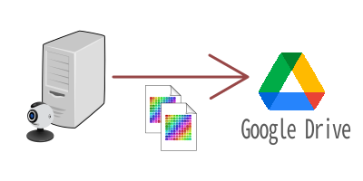
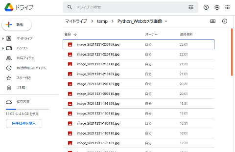
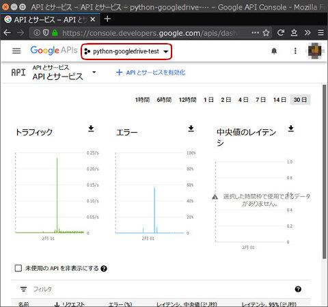
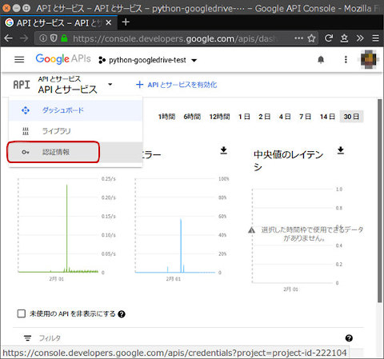
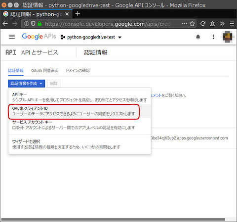
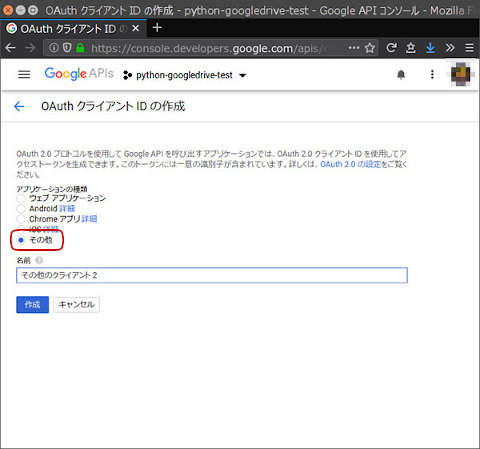
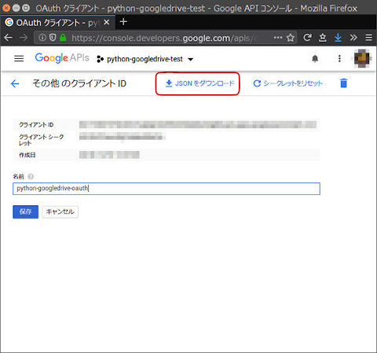
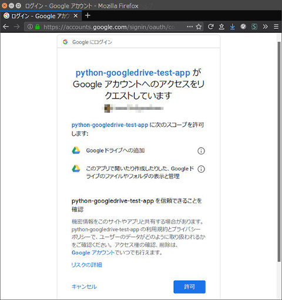
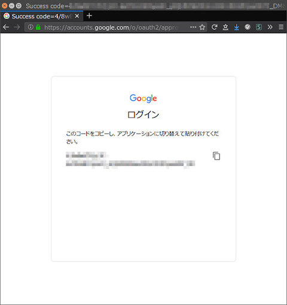

GoogleDriveにUSBカメラの画像をアップロード(Pythonスクリプト) <br/>Google Drive Uploader for USB camera image, Linux Python script

---
[Home](https://oasis3855.github.io/webpage/) > [Software](https://oasis3855.github.io/webpage/software/index.html) > [Software Download](https://oasis3855.github.io/webpage/software/software-download.html) > ***googledrive-webcamera*** (this page)

<br />
<br />


- [機能の概略](#機能の概略)
- [対象OS,依存ソフト等](#対象os依存ソフト等)
- [インストール](#インストール)
  - [必要なPythonモジュールのインストール](#必要なpythonモジュールのインストール)
  - [スクリプトの設置](#スクリプトの設置)
  - [Google Cloud Platformで認証を得る](#google-cloud-platformで認証を得る)
  - [Google Cloud Platformでの操作画面例](#google-cloud-platformでの操作画面例)
  - [定期的にスクリプトを自動実行させる](#定期的にスクリプトを自動実行させる)
- [バージョン履歴](#バージョン履歴)
- [ライセンス](#ライセンス)

## 機能の概略

Webカメラで撮影した画像ファイルを、Googleドライブにアップロードします。

Linux サーバ（Raspberry Piも含む）でcronを用いて定期的に実行することで、監視カメラとして使うことを意図しています。画像ファイル保存場所を外部（Googleドライブ）とすることで、サーバを破壊されても画像は残ります。

  

- Googleドライブのページ例

  


## 対象OS,依存ソフト等
- Linux
- Python
- [Google API Python client library](https://github.com/googleapis/google-api-python-client)
- [PyDrive](https://pypi.org/project/PyDrive/) 1.3.1 ( [ドキュメント](https://pythonhosted.org/PyDrive/) )

## インストール
### 必要なPythonモジュールのインストール

    pip install google-api-python-client
    pip install PyDrive

### スクリプトの設置
スクリプトをLinuxマシン内に設置。任意のディレクトリ内に、スクリプト本体とともに認証設定ファイルを置く必要がある

    任意のディレクトリ
      +-- upload_webcamera_gdrive.py
      +-- client_secrets.json
      +-- settings.yaml
      +-- gdrive_delete_oldfiles.py

### Google Cloud Platformで認証を得る
[Google Cloud Platform](https://console.cloud.google.com/) 内の「APIとサービス」を開いて、OAuth 2.0 クライアントIDを作成する。
手順の詳細はPyDriveドキュメントの[Quickstart](https://pythonhosted.org/PyDrive/quickstart.html)に詳しく解説されている。

OAuth 2.0 クライアントIDが作成完了すると、認証情報のJSONファイル（client_secrets.json）をダウンロードできる。

このJSONファイルに記載されたclient_idとclient_secretを、サンプルファイルのsettings.yaml内の該当項目に貼り付ける

### Google Cloud Platformでの操作画面例
- Google Cloud Platformでプロジェクトを新規作成する<br/>
赤で囲ったプロジェクト名をクリックすると、プロジェクトの選択・新規作成ができる

  

- APIとサービス画面を開き、認証情報をクリック

  

- 認証情報を作成をクリックし、OAuth クライアントID作成を行う

  

- アプリケーションの種類は「その他」を選択する
  今回の利用目的では、SSH接続のコマンドラインでしか初回設定を進められないため、必ず「その他」を選択する

  

- OAuth 2.0 クライアントIDの作成を完了したら、JSONファイルがダウンロードできる
  画面上部に「JSONをダウンロード」が表示されるので、クリックしてclient_secrets.jsonを保存する

  

  ダウンロードできる client_secrets.json は次のような書式となっていて、このファイルをスクリプトを設置したディレクトリにコピーする

<pre>
{
    "installed":{
        "client_id":"<b><em>123456789012-aHyiTb7k&w3Nuq4mPueWqcLk5iGjdxp2.apps.googleusercontent.com</em></b>",
        "project_id":"project-id-156354",
        "auth_uri":"https://accounts.google.com/o/oauth2/auth",
        "token_uri":"https://oauth2.googleapis.com/token",
        "auth_provider_x509_cert_url":"https://www.googleapis.com/oauth2/v1/certs",
        "client_secret":"<b><em>hjY6oh4Th387Jeirsy3lHiec</em></b>",
        "redirect_uris":["urn:ietf:wg:oauth:2.0:oob","http://localhost"]}
}
</pre>

- settings.yaml の内容を編集する

  client_secrets.jsonの client_id と client_secret （太字部分）を、下記サンプルファイルにコピー・ペーストすればよい
<pre>
client_config_backend: settings
client_config:
    client_id: <b><em>123456789012-aHyiTb7k&w3Nuq4mPueWqcLk5iGjdxp2.apps.googleusercontent.com</em></b>
    client_secret: <b><em>hjY6oh4Th387Jeirsy3lHiec</em></b>
save_credentials: True
save_credentials_backend: file
save_credentials_file: credentials.json
get_refresh_token: True
oauth_scope:
    - https://www.googleapis.com/auth/drive.file
    - https://www.googleapis.com/auth/drive.install
</pre>

- アクセス許可する

  初回のアクセス時に、Web認証を行う必要がある。サンプル スクリプト list_files(install).py を実行すると、Googleより認証URL文字列を含んだエラーが返される

<pre>
$ <b>python list_files(install).py</b>
 
/usr/local/lib/python2.7/dist-packages/oauth2client/_helpers.py:255: UserWarning: Cannot access credentials.json: No such file or directory
  warnings.warn(_MISSING_FILE_MESSAGE.format(filename))
Go to the following link in your browser:
()
    <b><em>https://accounts.google.com/o/oauth2/auth?redirect_uri=urn%3Aietf%3Awg%3Aoauth%3A2.0%3Aoob&response_type=code&client_id=123456789012-aHyiTb7kAw3Nuq4mPueWqcLk5iGjdxp2.apps.googleusercontent.com&scope=https%3A%2F%2Fwww.googleapis.com%2Fauth%2Fdrive.file+https%3A%2F%2Fwww.googleapis.com%2Fauth%2Fdrive.install&approval_prompt=force&access_type=offline</em></b>
()
Enter verification code:
</pre>

  太字部分の認証URLをブラウザに貼り付けてアクセスすると、次のような画面遷移で認証が完了する

  

  

### 定期的にスクリプトを自動実行させる

cronで定期実行させるために、```sudo crontab -e``` などで設定する。30分毎に画像送信する設定例は次の通り

この例では毎時1分と31分に画像送信し、毎日10時2分にGoogleドライブ内で限度数を超えた画像ファイルを一斉削除する

    1 5-23 * * * /usr/bin/python /usr/local/bin/pydrive_cam/upload_webcamera_gdrive.py --nomessage > /dev/null 2>&1
    31 8-21 * * * /usr/bin/python /usr/local/bin/gdrive-upload-camera/upload_webcamera_gdrive.py --nomessage > /dev/null 2>&1
    2 10 * * * /usr/bin/python /usr/local/bin/gdrive-upload-camera/gdrive_delete_oldfiles.py --nomessage > /dev/null 2>&1

## バージョン履歴
- Version 1.0 (2019/Feb/07)
- version 1.1 (2021/Dec/30) 
  - Python3対応


## ライセンス

このスクリプトは [GNU General Public License v3ライセンスで公開する](https://gpl.mhatta.org/gpl.ja.html) フリーソフトウエア
