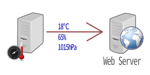
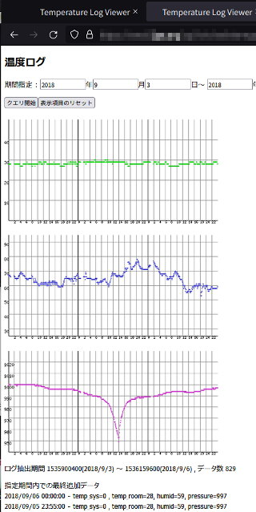

Webサーバに温湿度計測値をアップロード(Perlスクリプト) <br/>Web Uploader for temperature, humidity and pressure (BMP280, DHT11) , Linux Python Script

---
[Home](https://oasis3855.github.io/webpage/) > [Software](https://oasis3855.github.io/webpage/software/index.html) > [Software Download](https://oasis3855.github.io/webpage/software/software-download.html) > ***web-loggraph*** (this page)

<br />
<br />

- [機能の概略](#機能の概略)
- [インストール](#インストール)
  - [クライアント側（温湿度センサー側）でのスクリプトの設置](#クライアント側温湿度センサー側でのスクリプトの設置)
  - [Webサーバ側でのスクリプトの設置](#webサーバ側でのスクリプトの設置)
- [利用方法の流れ](#利用方法の流れ)
  - [データの定期記録の流れ](#データの定期記録の流れ)
  - [グラフ閲覧方法](#グラフ閲覧方法)
- [バージョン履歴](#バージョン履歴)
- [ライセンス](#ライセンス)

<br />
<br />

## 機能の概略

Linuxが稼働するレンタルサーバに、温湿度・気圧の計測値をアップロードし、グラフ表示させるスクリプト

Linux PC（Raspberry Piも含む）でcronを用いて定期的に実行することで、環境データのWebロガーとして使うことを意図しています。

  

- Webサーバで自動作成されるグラフ表示のサンプル例

  

## インストール
### クライアント側（温湿度センサー側）でのスクリプトの設置
スクリプトをLinuxマシン内に設置。任意のディレクトリ内に、スクリプト本体を置く

    任意のディレクトリ
      +-- send_data.pl

このスクリプトを、cron などで定期的に実行して、データ送信を行わせる

cronで定期実行させるために、```sudo crontab -e``` などで設定する。5分毎にデータ送信する設定例は次の通り

    */5 *  * * * /usr/bin/perl /usr/local/bin/send_tempdata.pl > /dev/null 2>&1

### Webサーバ側でのスクリプトの設置
スクリプトをLinuxマシン内・Web公開ディレクトリ配下にある任意のディレクトリ内に、スクリプト本体を置く

    Web公開ディレクトリ内の任意のディレクトリ
      +-- add_data.cgi
      +-- [web]dir
            +-- view_graph.cgi
      +-- [bin]dir
            +-- draw_tempgraph.pl
            +-- data_create.sql
            +-- data.sqlite3

まずは、データベースを初期化（作成）するために、[bin]ディレクトリ内で端末（コマンドライン）を開いて、data.sqlite3 データベースを作成する。

そのまま対話モードに入るので、readコマンドでテーブル作成用sql文data_create.sqlを読み込んで実行する。

<pre>
$ <b>sqlite3 data.sqlite3</b>
sqlite&gt; <b>.read data_create.sql</b>
</pre>

## 利用方法の流れ
### データの定期記録の流れ
クライアント側のsend_data.plが、サーバ側のadd_data.cgiにアクセスして、データをアップロードする

add_data.cgiは、bin/data.sqlite3にデータを格納する
### グラフ閲覧方法
ユーザは、ブラウザよりWebサーバのweb/view_graph.cgiにアクセスする

web/view_graph.cgiは、bin/data.sqlite3からデータを読み込み、bin/draw_tempgraph.plを使ってグラフを作成し、ユーザからアクセス可能なwebサーバ領域に保存する

## バージョン履歴
- Version 1.0 (2018/Apr/15)
- Version 1.1 (2018/Apr/24)
  - 湿度データ送信を追加
- Version 1.2 (2018/May/10)
  - BMP280 温度・気圧を追加


## ライセンス

このスクリプトは [GNU General Public License v3ライセンスで公開する](https://gpl.mhatta.org/gpl.ja.html) フリーソフトウエア
