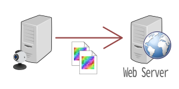
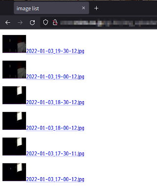

WebサーバにUSBカメラの画像をアップロード(Perlスクリプト) <br/>
Web Uploader for USB camera image , Linux Python script

---

[Home](https://oasis3855.github.io/webpage/) > [Software](https://oasis3855.github.io/webpage/software/index.html) > [Software Download](https://oasis3855.github.io/webpage/software/software-download.html) > ***webcamera-uploader*** (this page)

<br />
<br />

- [機能の概略](#機能の概略)
- [インストール](#インストール)
  - [クライアント側（カメラ接続したPC）でのスクリプトの設置](#クライアント側カメラ接続したpcでのスクリプトの設置)
  - [Webサーバ側でのスクリプトの設置](#webサーバ側でのスクリプトの設置)
- [バージョン履歴](#バージョン履歴)
- [ライセンス](#ライセンス)

<br />
<br />

## 機能の概略

Linuxが稼働するレンタルサーバに、Webカメラで撮影した画像ファイルをアップロードし、一覧表示させるスクリプト

Linux PC（Raspberry Piも含む）でcronを用いて定期的に実行することで、監視カメラとして使うことを意図しています。画像ファイル保存場所を外部（遠隔地のWebサーバ）とすることで、監視カメラを接続したPCを破壊されても画像は残ります。

  

- Webサーバで自動作成される一覧表示のサンプル例

  

## インストール
### クライアント側（カメラ接続したPC）でのスクリプトの設置
スクリプトをLinuxマシン内に設置。任意のディレクトリ内に、スクリプト本体を置く

    任意のディレクトリ
      +-- img_send_withauth_rpi.pl

このスクリプトを、cron などで定期的に実行して、写真撮影と送信を行わせる

### Webサーバ側でのスクリプトの設置
スクリプトをLinuxマシン内・Web公開ディレクトリ配下にある任意のディレクトリ内に、スクリプト本体を置く

    Web公開ディレクトリ内の任意のディレクトリ
      +-- img_receive.cgi

cronで定期実行させるために、```sudo crontab -e``` などで設定する。30分毎に画像送信する設定例は次の通り

    0 5-23 * * * /usr/bin/perl /usr/local/bin/img_send_withauth_rpi.pl > /dev/null 2>&1
    30 8-21 * * * /usr/bin/perl /usr/local/bin/img_send_withauth_rpi.pl > /dev/null 2>&1

## バージョン履歴
- Version 1.0 (2021/Dec/26)


## ライセンス

このスクリプトは [GNU General Public License v3ライセンスで公開する](https://gpl.mhatta.org/gpl.ja.html) フリーソフトウエア
